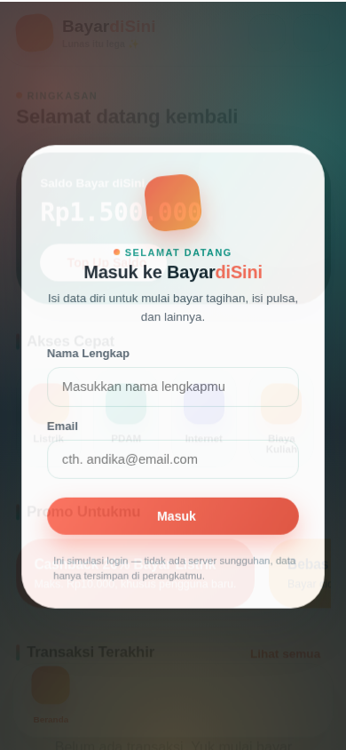
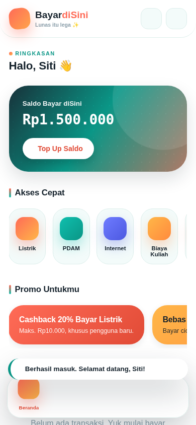
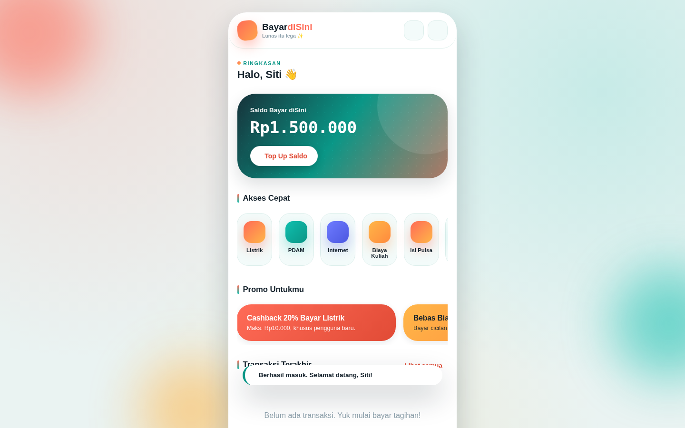
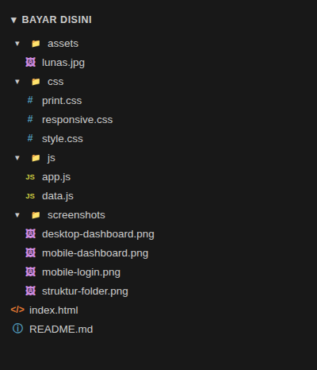

# 💸 Bayar diSini

**Bayar diSini** adalah aplikasi web simulasi untuk membayar tagihan rutin (listrik, PDAM, internet, seminar/event), cicilan biaya kuliah (SPP), dan isi pulsa/paket data — lengkap dengan alur login, saldo, riwayat transaksi, dan struk digital bercap "LUNAS". Dibangun murni dengan **HTML5, CSS3, dan Vanilla JavaScript (ES6+)**, tanpa framework, backend, atau database sungguhan. Seluruh data (profil, saldo, riwayat, tema) disimpan di `localStorage` milik browser.

> ⚠️ **Catatan**: Ini aplikasi simulasi untuk keperluan belajar/tugas. Tidak ada uang sungguhan yang diproses dan tidak terhubung ke sistem PLN/PDAM/kampus/provider yang asli. Login juga bersifat simulasi (tanpa server/password sungguhan).

---

## 🚀 Cara Menjalankan

Tidak perlu instalasi atau build tool apa pun.

1. Ekstrak folder proyek ini.
2. Buka file **`index.html`** langsung dua kali klik di browser (disarankan Chrome/Edge/Firefox versi terbaru).
3. Selesai — aplikasi langsung berjalan sepenuhnya di sisi klien (client-side).

*(Opsional)* Jika ingin menjalankan lewat local server (supaya seluruh fitur browser bekerja normal):

```bash
# Python 3
python -m http.server 8080
# lalu buka http://localhost:8080
```

## 🌐 Demo

> Ganti tautan di bawah ini dengan URL demo kamu setelah deploy ke GitHub Pages / Netlify / Vercel:
>
> 🔗 **Live demo:** [https://sitiadawiyah.github.io/Siti-Adawiyah-Bayar-diSini/] *(placeholder — perbarui setelah deploy)*

Cara cepat deploy ke **GitHub Pages**:
1. Push folder ini ke sebuah repository GitHub.
2. Buka **Settings → Pages** → pilih branch `main` dan folder `/ (root)`.
3. Tunggu beberapa menit, lalu akses URL yang diberikan GitHub.

Atau ke **Netlify**: buka [app.netlify.com/drop](https://app.netlify.com/drop) lalu drag-and-drop folder proyek ini — otomatis dapat link demo tanpa perlu akun git.

---

## ✨ Daftar Fitur yang Sudah Diimplementasikan

### Autentikasi (Simulasi)
- [x] Layar **Login** (nama + email) sebagai gerbang sebelum masuk aplikasi, dengan validasi input.
- [x] Status login tersimpan di `localStorage` — tidak perlu login ulang setiap kunjungan.
- [x] Sapaan personal di dashboard ("Halo, `<Nama>` 👋").
- [x] Tombol **Keluar (Logout)** di halaman Profil.

### Halaman/Section Utama (SPA, tanpa reload)
- [x] **Beranda** — saldo simulasi (dengan Top Up manual), akses cepat kategori, promo banner (scroll horizontal), daftar transaksi terakhir.
- [x] **Bayar Tagihan** — 4 kategori: Listrik (PLN), PDAM, Internet, Seminar/Event.
  - Validasi input nomor pelanggan.
  - Hasil cek tagihan: nama pelanggan, tagihan pokok, denda, jatuh tempo, total.
  - 3 metode pembayaran: **Virtual Account** (nomor VA + pilihan 4 bank), **QRIS** (QR code asli + countdown 5 menit), **Bayar di Teller** (kode pembayaran + daftar lokasi).
  - Loading state saat cek tagihan & saat memproses pembayaran.
  - Modal struk digital dengan animasi stempel **"LUNAS"**, bisa dicetak (`window.print()`).
- [x] **Biaya Kuliah (SPP)** — input NIM → daftar cicilan per semester dengan checkbox multi-pilih, tombol "Pilih Semua Belum Lunas", total otomatis, pencarian berdasarkan Kode Tagihan.
- [x] **Isi Pulsa & Paket Data** — grid provider dengan **deteksi otomatis** dari 4 digit awal nomor HP, nominal preset/custom, paket data per provider.
- [x] **Riwayat Transaksi** — tabel dari `localStorage`, filter kategori & pencarian teks, tombol hapus semua riwayat (dengan konfirmasi).
- [x] **Profil Pengguna** — ubah nama & email, tombol Simpan, tombol Keluar.
- [x] **Bantuan/FAQ** — accordion pertanyaan umum.
- [x] **Dark/Light Mode** — toggle di topbar, preferensi tersimpan otomatis.
- [x] Notifikasi toast (sukses/error/info), validasi form real-time, modal custom (bottom-sheet ala aplikasi mobile).
- [x] Accessibility — semantic HTML, atribut ARIA, skip link, fokus keyboard terlihat jelas, kontras warna memadai di kedua tema.

### Desain
- [x] Tampilan **selalu berbentuk mobile** (topbar + floating dock navigation di bawah) pada semua ukuran layar — tidak pernah berubah jadi tata letak sidebar/desktop.
- [x] Tema visual "Sunset Dock": kombinasi warna coral × teal, glassmorphism, kartu saldo animasi, dan bottom-sheet modal.

### Edge Case yang Ditangani
- NIM/nomor pelanggan tidak terdaftar → pesan error jelas, tidak crash.
- Tagihan yang sudah berstatus "Lunas" → checkbox otomatis dinonaktifkan.
- Nomor HP tidak valid → validasi real-time.
- Tombol "Bayar Sekarang" hanya aktif bila metode pembayaran sudah dipilih.
- Hapus riwayat transaksi → meminta konfirmasi sebelum menghapus.
- QRIS kedaluwarsa setelah 5 menit → status berubah otomatis.
- Nama/email login kosong atau format email salah → pesan error di bawah field, tidak lolos submit.

---

## 📱 Screenshot

### Tampilan Mobile
| Layar Login | Dashboard |
|---|---|
|  |  |

### Tampilan Desktop / Layar Lebar
Aplikasi ini sengaja **selalu tampil dalam bentuk mobile** meskipun dibuka di layar lebar — muncul sebagai kartu ponsel yang melayang di tengah, bukan tata letak sidebar ala aplikasi desktop.



---

## 🗂️ Struktur Folder




## 🎨 Konsep Desain

- **Nama & identitas**: "Bayar diSini" — dari kata "lunas", setiap pembayaran ditandai **stempel "LUNAS"** bergaya cap kasir di struk digital.
- **Palet warna**: coral hangat (`#FF6B57`) dipadu teal segar (`#0FBFAE`) dan aksen emas (`#FFB648`), mendukung mode gelap penuh.
- **Tipografi**: *Sora* untuk judul, *Plus Jakarta Sans* untuk teks umum, *JetBrains Mono* untuk seluruh angka/kode agar mudah dipindai seperti pada struk asli.
- **Layout**: topbar + floating dock navigation ala aplikasi mobile banking, konsisten di semua ukuran layar.

## 🧪 Data Simulasi (untuk mencoba aplikasi)

**PLN**: `123456789012`, `129876543210`, `115533779911`, `110022334455`, `119988776655`

**PDAM**: `PD001234`, `PD005678`, `PD009911`

**Internet**: `INT77001122`, `INT77003344`, `INT77005566`

**Seminar/Event**: `SEM2026WEBDEV`, `SEM2026UIUX01`, `SEM2026AICON`

**NIM (Biaya Kuliah)**: `202310001`, `202310002`, `202310003`

**Kode Tagihan contoh**: `986248962486438` (NIM 202310001)

**Nomor HP** (uji deteksi provider): `0812` (Telkomsel), `0817` (XL), `0815` (Indosat), `0895` (Tri), `0881` (Smartfren), `0831` (Axis).

**Login**: bebas isi nama & email apa saja (tidak ada akun baku, karena ini simulasi).

## 🛠️ Teknologi yang Digunakan

- HTML5 semantic + ARIA
- CSS3 (Custom Properties, Flexbox, Grid, `@media print`)
- Vanilla JavaScript ES6+ (tanpa framework)
- [Font Awesome 6](https://fontawesome.com/) via CDN — ikon
- [qrcode.js](https://github.com/davidshimjs/qrcodejs) via CDN — QR code QRIS
- [jsPDF](https://github.com/parallax/jsPDF) via CDN — tersedia untuk ekspor PDF (opsional/pengembangan lanjutan)
- Google Fonts: Sora, Plus Jakarta Sans, JetBrains Mono

## 💡 Pengembangan Lanjutan (ide jika ingin dikembangkan)

- Statistik pengeluaran bulanan dengan Chart.js pada halaman Riwayat.
- Export struk ke PDF menggunakan jsPDF (library sudah dimuat di `index.html`).
- Login multi-user dengan beberapa akun contoh & avatar berbeda.

---
Dibuat sebagai proyek tugas kuliah — Aplikasi Web Pembayaran Tagihan Multi-Layanan & Pengisian Pulsa.
